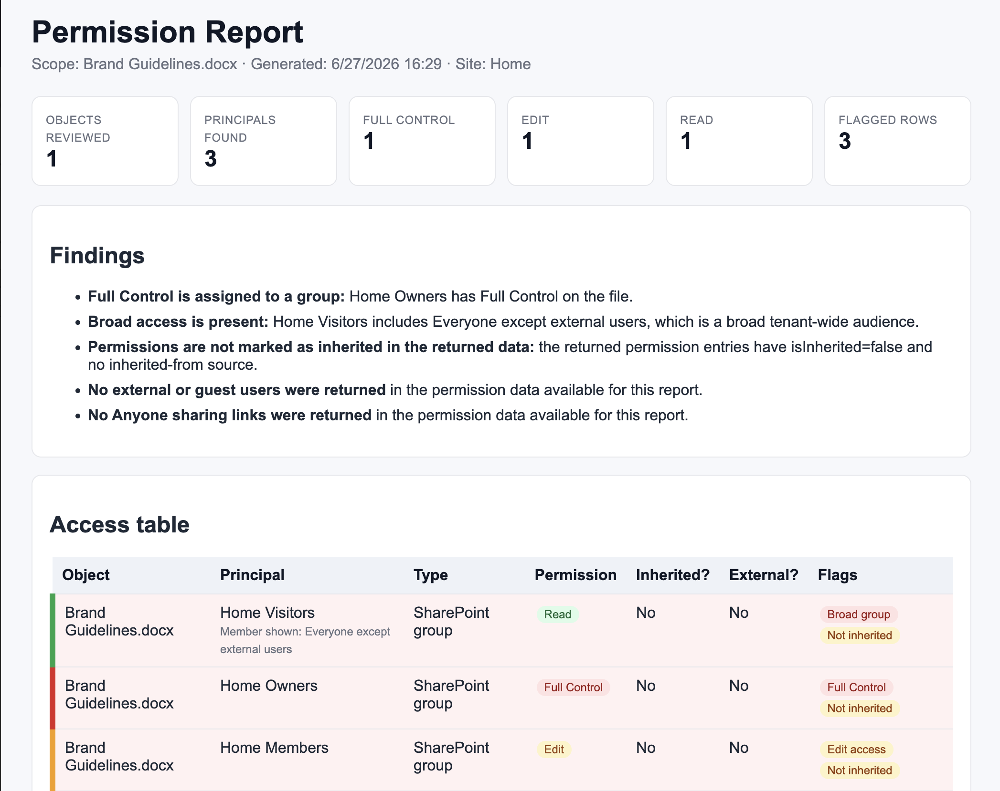

# Permission Report

Creates a read-only SharePoint permission and sharing access review report as a self-contained HTML file.

## What you get

- Access review coverage for selected files/folders, a named list or library, or the current site scope
- A risk-focused findings summary that flags Anyone links, external/guest users, broad groups, unique permissions, and individual Full Control grants
- A self-contained HTML report with summary cards, a color-coded access table, and a limitations section when data is partial
- The file saved in an `Access Reports` folder with a clear timestamped report name
- Strictly read-only behavior for permissions and sharing (no grants/revokes/sharing changes)

## When to use

Ask Copilot:

- _"who has access"_ / _"permission report"_ / _"sharing report"_
- _"access review"_ / _"review permissions"_
- _"check external sharing"_ / _"audit permissions on this library"_

Best when you need a fast, defensible access snapshot for audit, handover, or governance reviews without changing any permissions.

## SharePoint Skill

| Solution          | Author(s)                                                                                                              |
| ----------------- | ---------------------------------------------------------------------------------------------------------------------- |
| permission-report | Sandeep P S ( [GitHub](https://github.com/Sandeep-FED) &#124; [LinkedIn](https://www.linkedin.com/in/sandeepps1299/) ) |

## Version history

| Version | Date     | Comments        |
| ------- | -------- | --------------- |
| 1.0     | Jun 2026 | Initial Release |

## Disclaimer

**THIS CODE IS PROVIDED _AS IS_ WITHOUT WARRANTY OF ANY KIND, EITHER EXPRESS OR IMPLIED, INCLUDING ANY IMPLIED WARRANTIES OF FITNESS FOR A PARTICULAR PURPOSE, MERCHANTABILITY, OR NON-INFRINGEMENT.**

