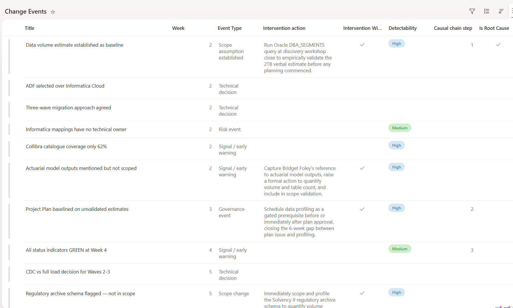

# Project Intelligence - Change Event Extraction

Reads every document in a SharePoint project library and writes a complete, structured change-event log to a SharePoint list — the factual foundation of the Project Intelligence Engine.

## What you get

- A fully populated **Change Events** SharePoint list — one row per event, 16 structured fields
- Every event categorized (scope, risk, governance, budget, schedule, technical, signal) with HIGH/MEDIUM/LOW signal strength
- Headline metrics — HIGH-signal events, governance gap score, and Scope Churn Index
- A Missing Information summary of the documentation gaps a well-run engagement would not have
- Three summary levels (ultra-short, get-me-up-to-speed, detailed) plus a Project Intelligence Dashboard

## Prerequisites — site setup

Before the first run, create a **Change Events** SharePoint list on the project site with the columns below. This one list is shared by all three Project Intelligence Engine skills — the first 16 columns are populated by this skill, and the last 7 are written back by Root Cause Analysis — so set it up once, up front.

| Column | Type | Populated by |
| --- | --- | --- |
| Event # | Number (unique) | Change Event Extraction |
| Date | Single line of text | Change Event Extraction |
| Week | Number | Change Event Extraction |
| Event Type | Choice | Change Event Extraction |
| Source Document | Single line of text | Change Event Extraction |
| Title | Single line of text (item title) | Change Event Extraction |
| Description | Multiple lines of text | Change Event Extraction |
| Parameter Changed | Single line of text (store as `before → after`) | Change Event Extraction |
| Reason / Rationale | Multiple lines of text | Change Event Extraction |
| Raised By | Single line of text | Change Event Extraction |
| Approved / Acknowledged By | Single line of text | Change Event Extraction |
| Action Taken | Single line of text | Change Event Extraction |
| Missing Information | Multiple lines of text | Change Event Extraction |
| Impact | Multiple lines of text | Change Event Extraction |
| Change Order Raised | Choice (Yes / No / Pending / N/A) | Change Event Extraction |
| Signal Strength | Choice (HIGH / MEDIUM / LOW) | Change Event Extraction |
| Is Root Cause | Yes/No | Root Cause Analysis |
| Root Cause Statement | Multiple lines of text | Root Cause Analysis |
| Causal Chain Step | Number | Root Cause Analysis |
| Intervention Window | Yes/No | Root Cause Analysis |
| Intervention Action | Multiple lines of text | Root Cause Analysis |
| Early Warning Signal | Yes/No | Root Cause Analysis |
| Detectability | Choice (HIGH / MEDIUM / LOW) | Root Cause Analysis |

The skill also reads and writes a `SHAREPOINT.md` site context file that persists results across sessions — it is created and maintained at runtime, so no setup is required for it.

## SharePoint Skill

| Solution | Author(s) |
| --- | --- |
| project-intelligence-change-event-extraction | Matt Wolodarsky &#124; [GitHub](https://github.com/mattwolodarsky-droid) |

## Version history

| Version | Date | Comments |
| --- | --- | --- |
| 1.0 | July 2026 | Initial Release |

## Disclaimer

**THIS CODE IS PROVIDED _AS IS_ WITHOUT WARRANTY OF ANY KIND, EITHER EXPRESS OR IMPLIED, INCLUDING ANY IMPLIED WARRANTIES OF FITNESS FOR A PARTICULAR PURPOSE, MERCHANTABILITY, OR NON-INFRINGEMENT.**

