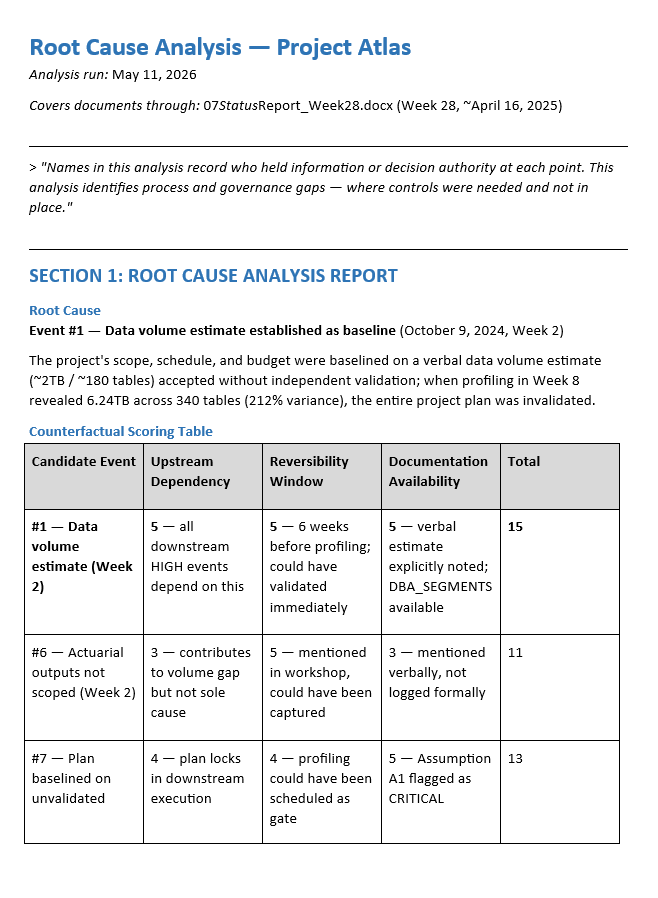

# Project Intelligence - Root Cause Analysis

Turns the Change Events list into a full causal analysis — root cause, causal chain, intervention windows, and early-warning signals — with one actionable recommendation.

## What you get

- The primary **root cause** identified via a counterfactual test, with the full scoring table
- The **causal chain** from root cause to impact, with intervention windows marked
- **Early-warning signal** analysis with detectability ratings and lag statistics
- A **failure classification** and a single, structured, implementable recommendation
- Findings persisted to the Change Events list, a dated analysis document, and the site context file

## Prerequisites

Runs after **Change Event Extraction**, which populates the Change Events list this skill analyses and writes its findings back to. See the Change Event Extraction skill's README for the one-time list setup and column schema.

## SharePoint Skill

| Solution | Author(s) |
| --- | --- |
| project-intelligence-root-cause-analysis | Matt Wolodarsky &#124; [GitHub](https://github.com/mattwolodarsky-droid) |

## Version history

| Version | Date | Comments |
| --- | --- | --- |
| 1.0 | July 2026 | Initial Release |

## Disclaimer

**THIS CODE IS PROVIDED _AS IS_ WITHOUT WARRANTY OF ANY KIND, EITHER EXPRESS OR IMPLIED, INCLUDING ANY IMPLIED WARRANTIES OF FITNESS FOR A PARTICULAR PURPOSE, MERCHANTABILITY, OR NON-INFRINGEMENT.**

