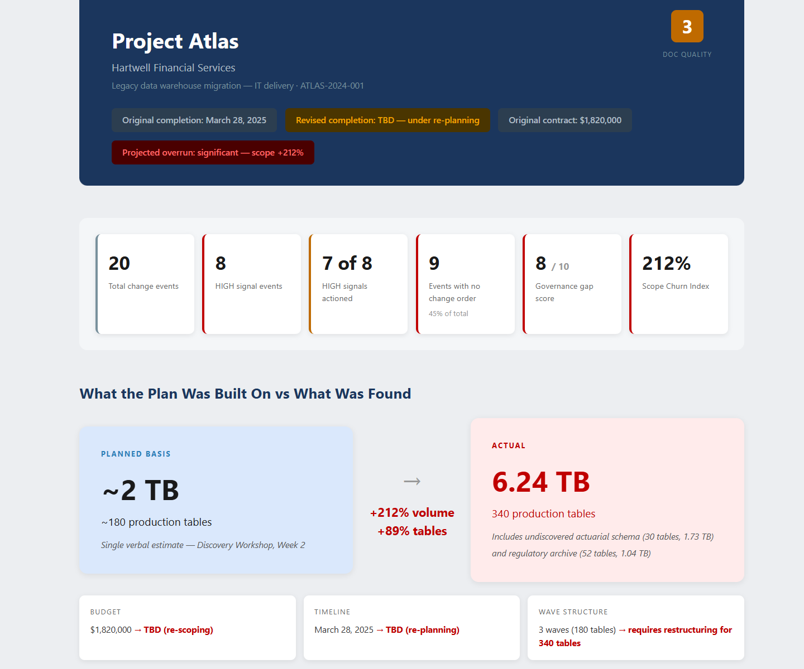

# Project Intelligence - Timeline Dashboard

Generates a self-contained HTML timeline dashboard that visualises the Project Intelligence Engine output for delivery directors and steering committees — no external dependencies.

## What you get

- A single **self-contained HTML dashboard** (no external dependencies) saved to SharePoint
- A KPI metrics bar, a **planned-vs-actual contrast panel**, and a root-cause callout
- A vertical **signal-trail timeline** with governance and intervention-window markers
- An **early-warnings-missed** table and a two-column governance summary
- A recommendation card — the whole failure story, scannable in under five minutes

## Prerequisites

Runs last in the Project Intelligence Engine, after **Change Event Extraction** and **Root Cause Analysis** have populated the Change Events list. See the Change Event Extraction skill's README for the one-time list setup and column schema.

## SharePoint Skill

| Solution | Author(s) |
| --- | --- |
| project-intelligence-timeline-dashboard | Matt Wolodarsky &#124; [GitHub](https://github.com/mattwolodarsky-droid) |

## Version history

| Version | Date | Comments |
| --- | --- | --- |
| 1.0 | July 2026 | Initial Release |

## Disclaimer

**THIS CODE IS PROVIDED _AS IS_ WITHOUT WARRANTY OF ANY KIND, EITHER EXPRESS OR IMPLIED, INCLUDING ANY IMPLIED WARRANTIES OF FITNESS FOR A PARTICULAR PURPOSE, MERCHANTABILITY, OR NON-INFRINGEMENT.**

